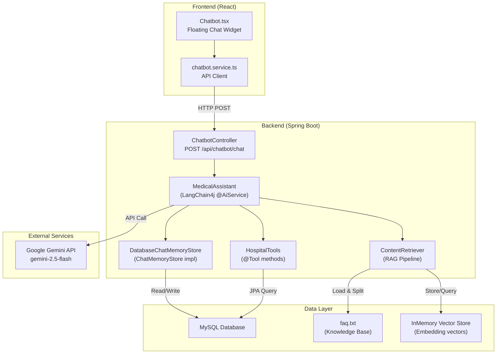
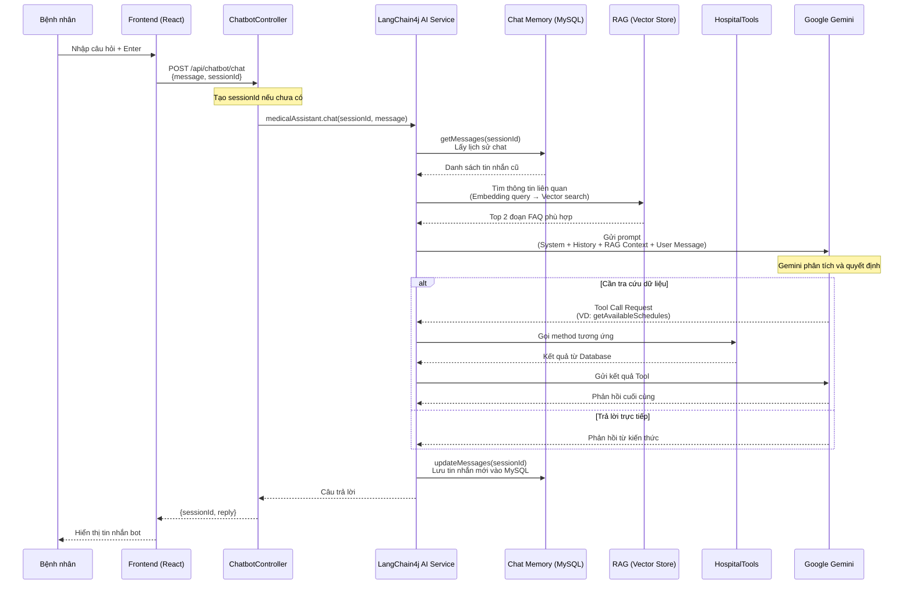

# Chatbot AI Trợ lý Y tế — Mô tả chức năng, Công nghệ & Kiến trúc

## 1. Mô tả chức năng

Chatbot AI Trợ lý Y tế (**MediCare AI**) là một trợ lý ảo thông minh tích hợp trực tiếp vào hệ thống quản lý bệnh viện, được thiết kế riêng cho **bệnh nhân** (role PATIENT) với các khả năng:

### Chức năng chính
| Chức năng | Mô tả |
|:---|:---|
| **Giải đáp thắc mắc y tế** | Tư vấn triệu chứng, gợi ý chuyên khoa phù hợp để bệnh nhân đi khám |
| **Tra cứu thông tin bệnh viện** | Giờ mở cửa, chi phí khám, thủ tục nhập viện, quy định xét nghiệm (RAG) |
| **Tra cứu chuyên khoa** | Lấy danh sách chuyên khoa hiện có từ database (Tool Calling) |
| **Tra cứu bác sĩ** | Lấy thông tin bác sĩ: tên, chuyên khoa, bằng cấp (Tool Calling) |
| **Tra cứu lịch khám trống** | Tìm lịch khám còn slot theo bác sĩ/chuyên khoa/ngày (Tool Calling) |
| **Duy trì ngữ cảnh hội thoại** | Nhớ lịch sử chat trong phiên, hỗ trợ hội thoại đa lượt (Chat Memory) |
| **Từ chối câu hỏi ngoài lề** | Lịch sự từ chối các câu hỏi không liên quan y tế (toán, lập trình, chính trị...) |

### Ràng buộc an toàn
- ❌ **Không tự chẩn đoán bệnh** chính xác
- ❌ **Không kê đơn thuốc**
- ✅ Chỉ **tư vấn** và **hướng dẫn** đến chuyên khoa phù hợp

### Giao diện người dùng
- Nút chat hình tròn (FAB) ở góc phải dưới màn hình — **chỉ hiển thị cho bệnh nhân**
- Cửa sổ chat dạng popup 360x520px với thiết kế glassmorphism
- Hiệu ứng typing indicator (3 dot bounce) khi AI đang xử lý
- Auto-scroll xuống tin nhắn mới nhất

---

## 2. Công nghệ sử dụng

### Backend

| Công nghệ | Phiên bản | Vai trò |
|:---|:---|:---|
| **Spring Boot** | 4.0.3 | Framework chính |
| **LangChain4j** | 1.13.1-beta23 | Framework AI Agent — quản lý prompt, memory, tool, RAG |
| **Google Gemini** | gemini-2.5-flash | LLM (Large Language Model) — engine xử lý ngôn ngữ tự nhiên |
| **All-MiniLM-L6-V2** | (ONNX, local) | Embedding Model — chuyển văn bản thành vector cho RAG |
| **MySQL** | — | Lưu trữ lịch sử chat (Chat Memory) |
| **JPA/Hibernate** | — | ORM cho entity ChatMessage |

### Frontend

| Công nghệ | Vai trò |
|:---|:---|
| **React** + **TypeScript** | Xây dựng giao diện chat |
| **Lucide React** | Icon library (MessageCircle, Send, X) |
| **Axios** | HTTP client gọi API chatbot |

### Dependencies (pom.xml)

```xml
<!-- LangChain4j Core + Spring Boot Starter -->
<artifactId>langchain4j-spring-boot4-starter</artifactId>

<!-- Kết nối Google Gemini -->
<artifactId>langchain4j-google-ai-gemini-spring-boot4-starter</artifactId>

<!-- Embedding model chạy local (ONNX) — KHÔNG cần API key -->
<artifactId>langchain4j-embeddings-all-minilm-l6-v2</artifactId>
```

---

## 3. Kiến trúc hệ thống

### Sơ đồ kiến trúc tổng quan



### Luồng xử lý chi tiết



---

## 4. Cấu trúc thư mục

```
be-hospital/src/main/java/.../chatbot/
├── config/
│   ├── ChatbotConfig.java          # Cấu hình ChatModel (Gemini) + ChatMemoryProvider
│   └── RagConfig.java              # Cấu hình RAG: EmbeddingModel, VectorStore, ContentRetriever
├── controller/
│   └── ChatbotController.java      # REST API endpoint POST /api/chatbot/chat
├── service/
│   └── MedicalAssistant.java       # @AiService interface (LangChain4j tự tạo impl)
├── tools/
│   └── HospitalTools.java          # @Tool methods: chuyên khoa, bác sĩ, lịch khám
└── memory/
    ├── DatabaseChatMemoryStore.java # Impl ChatMemoryStore → lưu/đọc tin nhắn từ MySQL
    ├── entity/
    │   └── ChatMessageEntity.java  # JPA Entity: id, sessionId, messageJson, createdAt
    └── repository/
        └── ChatMessageRepository.java

fe-hospital/src/
├── components/Chatbot.tsx          # UI component chat widget
└── services/chatbot.service.ts     # API client
```

---

## 5. Mô tả chi tiết từng thành phần

### 5.1. RAG Pipeline (Retrieval-Augmented Generation)

> **Mục đích**: Cho phép AI trả lời câu hỏi về quy định bệnh viện dựa trên tài liệu thực tế, thay vì "bịa" thông tin.

**Quy trình RAG:**

```
faq.txt → Document Loader → Document Splitter (300 token/chunk, overlap 30)
       → Embedding Model (All-MiniLM-L6-V2) → Vector Store (InMemory)
```

**Khi có câu hỏi:**

```
User question → Embed thành vector → Tìm top 2 chunk tương đồng nhất (minScore ≥ 0.6)
             → Đính kèm vào prompt gửi cho Gemini
```

**Dữ liệu FAQ hiện tại:**
- Giờ mở cửa bệnh viện
- Chi phí khám dịch vụ
- Chính sách BHYT
- Thủ tục nhập viện
- Quy định xét nghiệm máu

### 5.2. Tool Calling (Function Calling)

> **Mục đích**: Cho phép AI truy vấn dữ liệu "sống" từ database thay vì chỉ dựa trên kiến thức tĩnh.

| Tool | Input | Output | Mô tả |
|:---|:---|:---|:---|
| `getSpecialties()` | — | `List<SpecialtyDTO>` | Danh sách chuyên khoa |
| `getDoctors()` | — | `List<AccountResponse>` | Danh sách bác sĩ (role=DOCTOR) |
| `getAvailableSchedules()` | specialtyId, doctorId, date | `List<ScheduleDTO>` | Lịch khám còn slot |

**Cách hoạt động**: Gemini tự quyết định khi nào cần gọi Tool dựa trên câu hỏi. VD: "Bác sĩ Nguyễn Văn A có lịch khám ngày mai không?" → Gemini gọi `getAvailableSchedules(null, <doctorId>, "2026-05-16")`.

### 5.3. Chat Memory (Persistent)

> **Mục đích**: Duy trì ngữ cảnh hội thoại giữa các tin nhắn trong cùng một phiên.

- **Lưu trữ**: MySQL (bảng `chat_message`)
- **Giới hạn**: 20 tin nhắn gần nhất (`maxMessages=20`)
- **Cơ chế**: Mỗi lần gọi API, LangChain4j tự load lịch sử từ DB → đính kèm vào prompt → sau đó lưu lại

### 5.4. System Prompt

AI được cấu hình với các nguyên tắc:
1. Đóng vai trò **trợ lý y tế chuyên nghiệp** của phòng khám
2. Tư vấn chuyên khoa dựa trên triệu chứng
3. Dùng thông tin RAG cho câu hỏi quy định/giờ giấc/chi phí
4. **Từ chối** câu hỏi ngoài lề (toán, lập trình, chính trị...)
5. Trả lời bằng **tiếng Việt**, lịch sự, dễ hiểu
6. **Không chẩn đoán** bệnh chính xác, **không kê đơn thuốc**

---

## 6. Cấu hình quan trọng

| Tham số | Giá trị | Ý nghĩa |
|:---|:---|:---|
| `gemini.api.key` | (từ application.properties) | API key Google Gemini |
| Model name | `gemini-2.5-flash` | Model AI nhanh, tiết kiệm |
| Temperature | `0.2` | Trả lời chính xác, ít sáng tạo (phù hợp y tế) |
| Max output tokens | `1024` | Giới hạn độ dài phản hồi |
| Embedding model | `All-MiniLM-L6-V2` | Chạy local (ONNX), không tốn API |
| RAG max results | `2` | Lấy 2 đoạn liên quan nhất |
| RAG min score | `0.6` | Ngưỡng độ tương đồng tối thiểu |
| Chat memory | `20` messages | Giới hạn lịch sử hội thoại |
